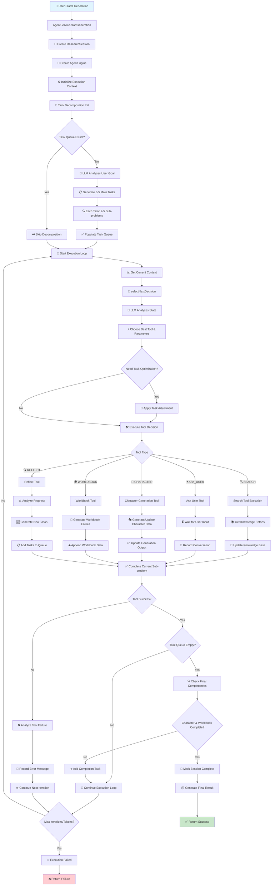

# 🎭 角色卡与世界书生成器

一个基于高级计划架构的AI驱动命令行工具，用于生成角色卡和世界书条目。

## ✨ 特性

- 🤖 **AI智能生成**: 支持 OpenAI GPT 模型或本地 Ollama 模型
- 📋 **计划驱动架构**: 智能任务规划与执行
- 🎯 **交互模式**: 逐步引导的角色创建
- 📦 **批量模式**: 直接命令行生成
- 💾 **导出选项**: JSON、角色卡、世界书格式
- ⚙️ **可配置**: 保存默认设置以便快速访问
- 🔄 **进度跟踪**: 实时生成监控

## 🏗️ 系统架构

本系统采用计划驱动的智能代理架构，以下是完整的工作流程：



### 🎯 核心组件

- **AgentEngine**: 中央规划与执行引擎
- **智能工具系统**: 5个专业工具（搜索、用户交互、角色生成、世界书、反思）
- **任务分解**: 将复杂目标分解为可执行的子问题
- **实时决策**: LLM驱动的动态工具选择和参数生成
- **状态持久化**: 完整的会话状态保存与恢复

## 📦 安装

### 系统要求

- Node.js 16+ 
- pnpm（如果缺失将自动安装）

### 快速开始

1. **克隆并构建**:
   ```bash
   git clone <repository>
   cd character-generator
   ./build.sh
   ```

2. **运行交互模式**:
   ```bash
   char-gen generate --interactive
   ```

3. **或全局安装**:
   ```bash
   npm link
   char-gen generate --interactive
   ```

## 🚀 使用方法

### 交互模式（推荐）

启动交互式角色生成向导：

```bash
char-gen generate --interactive
```

这将引导您完成：
- 角色描述
- AI模型选择
- API密钥配置
- 输出设置

### 直接模式

使用命令行参数直接生成角色：

```bash
# 使用 OpenAI
char-gen generate \
  --model gpt-4 \
  --api-key YOUR_API_KEY \
  --type openai \
  --output ./my-character

# 使用 Ollama（本地）
char-gen generate \
  --model llama2 \
  --base-url http://localhost:11434 \
  --type ollama \
  --output ./my-character
```

### 配置设置

设置默认配置以避免重复输入：

```bash
char-gen config
```

这将保存您的首选项：
- AI服务（OpenAI/Ollama）
- 默认模型
- API密钥
- 温度设置

### 查看历史生成

```bash
char-gen list
```

### 导出指定生成

```bash
# 导出完整结果
char-gen export <generation-id>

# 仅导出角色卡
char-gen export <generation-id> --format card

# 仅导出世界书
char-gen export <generation-id> --format worldbook
```

## 📝 命令参考

### 主要命令

- `generate` (别名: `gen`) - 生成新的角色和世界书
- `config` - 配置默认设置
- `list` - 列出历史生成
- `export <id>` - 导出指定生成

### 生成选项

- `-i, --interactive` - 交互模式
- `-o, --output <dir>` - 输出目录（默认: ./output）
- `-m, --model <model>` - 使用的AI模型
- `-k, --api-key <key>` - AI服务的API密钥
- `-u, --base-url <url>` - AI服务的基础URL
- `-t, --type <type>` - AI服务类型（openai|ollama）

### 导出选项

- `-f, --format <format>` - 导出格式（json|card|worldbook）
- `-o, --output <file>` - 输出文件路径

## 🤖 AI模型支持

### OpenAI 模型
- GPT-4（推荐）
- GPT-3.5-turbo
- 自定义微调模型

### Ollama 模型（本地）
- Llama 2
- Mistral
- CodeLlama
- 任何本地可用模型

## 📁 输出结构

生成的文件将保存到指定的输出目录：

```
output/
├── character.json          # 角色卡数据
├── worldbook.json          # 世界书条目
├── integration_notes.md    # 使用说明
└── complete_result.json    # 完整生成结果
```

### 角色卡格式

```json
{
  "name": "角色名称",
  "description": "角色描述...",
  "personality": "性格特征...",
  "scenario": "设定/场景...",
  "first_mes": "开场消息...",
  "mes_example": "示例对话...",
  "creator_notes": "创作者注释...",
  "tags": ["标签1", "标签2"],
  "alternate_greetings": ["问候语1", "问候语2"]
}
```

### 世界书条目格式

```json
[
  {
    "id": "条目ID",
    "key": ["触发", "关键词"],
    "content": "条目内容...",
    "comment": "条目描述",
    "constant": false,
    "order": 100
  }
]
```

## ⚙️ 配置

配置文件存储在 `~/.character-generator/config.json`：

```json
{
  "defaultType": "openai",
  "defaultModel": "gpt-4",
  "defaultApiKey": "sk-...",
  "temperature": 0.7,
  "maxTokens": 4000
}
```

### 搜索配置（可选）

内置搜索工具使用**免费服务**，无需额外配置：

- **DuckDuckGo 搜索**: 注重隐私的网页搜索（免费）
- **Wikipedia 搜索**: 百科全书内容（免费）

如需增强搜索功能，可选择配置高级搜索服务：

```json
{
  "search": {
    "googleApiKey": "your-google-api-key",
    "googleCxId": "your-custom-search-engine-id",
    "tavilyApiKey": "your-tavily-api-key",
    "serpApiKey": "your-serpapi-key"
  }
}
```

**注意**: 高级搜索服务完全可选。默认的免费搜索已能为角色和世界书生成提供优秀的结果。

## 💾 存储

所有数据本地存储在 `~/.character-generator/`：

- `config.json` - 用户配置
- `agent_conversations.json` - 生成历史
- 其他角色和世界书数据文件

## 📚 使用示例

### 简单角色生成

```bash
# 交互模式 - 最简单的方式
char-gen generate -i

# 直接模式最小选项
char-gen generate -m gpt-4 -k YOUR_API_KEY -t openai
```

### 高级用法

```bash
# 使用特定设置生成
char-gen generate \
  --model gpt-4 \
  --api-key sk-your-key \
  --type openai \
  --output ./fantasy-character \
  --interactive

# 使用本地 Ollama 模型
char-gen generate \
  --model llama2 \
  --type ollama \
  --base-url http://localhost:11434 \
  --output ./local-character
```

### 导出和分享

```bash
# 列出所有生成
char-gen list

# 导出特定角色
char-gen export abc12345 --format card --output my-character.json

# 仅导出世界书
char-gen export abc12345 --format worldbook --output worldbook.json
```

## 🔧 故障排除

### 常见问题

1. **API密钥问题**:
   ```bash
   # 首先设置配置
   char-gen config
   ```

2. **构建问题**:
   ```bash
   # 清理构建
   rm -rf dist node_modules
   ./build.sh
   ```

3. **权限问题**:
   ```bash
   # 使脚本可执行
   chmod +x build.sh start.sh
   ```

4. **Ollama连接问题**:
   ```bash
   # 检查 Ollama 是否运行
   curl http://localhost:11434/api/tags
   ```

### 调试模式

设置环境变量以获得详细日志：

```bash
DEBUG=character-generator char-gen generate -i
```

## 🏛️ 架构设计

CLI工具使用先进的计划驱动AI架构：

1. **代理引擎**: 中央规划和执行
2. **工具注册表**: 模块化工具系统（搜索、用户交互、角色生成、世界书、反思）
3. **任务分解**: 智能目标分解为可执行子问题
4. **实时决策**: LLM驱动的动态工具选择
5. **本地存储**: 基于文件的数据持久化

## 🛠️ 开发贡献

代码库组织结构：

```
src/
├── cli/                    # CLI 接口
├── core/                   # 代理引擎和服务
├── data/                   # 存储操作
├── models/                 # 类型定义
└── tools/                  # AI工具（搜索、生成等）
```

## 📄 许可证

MIT 许可证 - 详见 LICENSE 文件。

---

**祝您角色创作愉快！ 🎭✨** 