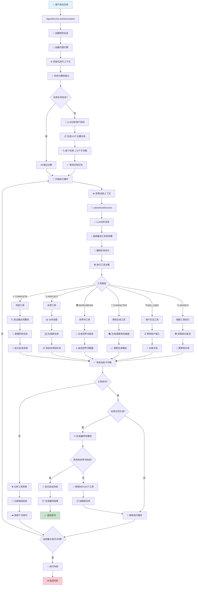

# 🎭 角色卡与世界书生成器

一个基于高级计划驱动架构的AI智能代理系统，用于生成高质量的角色卡和世界书条目。

## ✨ 核心特性

- 🤖 **智能计划驱动架构**: 基于DeepResearch理念的实时决策系统
- 🎯 **强制任务优化**: 每次工具执行后自动优化任务和子问题
- 🔄 **REFLECT工具机制**: 任务队列为空时智能创建新任务
- 📋 **角色优先策略**: 角色卡100%完成后才能创建世界书
- 🧠 **知识库集成**: 智能搜索和信息收集
- 💾 **完整状态管理**: 会话状态持久化和恢复
- ⚙️ **多模型支持**: OpenAI GPT和本地Ollama模型

## 🏗️ 系统架构

### 核心设计理念

本系统采用**计划驱动架构**，灵感来源于Jina AI的DeepResearch：持续搜索、阅读、推理直到找到答案。系统通过智能任务分解和实时决策来构建高质量的角色卡和世界书。

### 工作流程



## 🎯 核心组件

### 智能工具系统

1. **SEARCH工具**: 智能搜索和信息收集，支持多种搜索服务
2. **ASK_USER工具**: 用户交互和澄清，用于获取用户输入
3. **CHARACTER工具**: 角色卡生成和更新，逐步构建8个必需字段
4. **WORLDBOOK工具**: 世界书条目创建，仅在角色卡完成后使用
5. **REFLECT工具**: 任务队列为空时创建新任务，用于继续进度
6. **COMPLETE工具**: 会话完成和清理，验证输出完整性并结束会话

### 关键机制

- **强制任务优化**: 每次工具执行后自动重写任务描述和子问题
- **角色优先约束**: 角色卡8个必需字段完成后才能创建世界书
- **REFLECT触发条件**: 仅在任务队列为空但输出未完成时使用
- **实时决策**: LLM驱动的动态工具选择和参数生成

## 📦 安装

### 系统要求

- Node.js 16+ 
- pnpm（如果缺失将自动安装）

### 快速开始

1. **克隆并构建**:
   ```bash
   git clone <repository>
   cd character-generator
   ./build.sh
   ```

2. **配置默认设置**:
   ```bash
   char-gen config
   ```

3. **开始生成**:
   ```bash
   char-gen generate
   ```

## 🚀 使用方法

### 基本使用

```bash
# 交互模式（推荐）
char-gen generate
```

### 配置设置

```bash
char-gen config
```

配置选项包括：
- AI服务类型（OpenAI/Ollama）
- 默认模型
- API密钥
- 温度设置
- 最大令牌数
- Tavily搜索API密钥（可选）

### 查看历史

```bash
# 列出所有生成
char-gen list
```

## 🎭 角色卡生成

### 必需字段

角色卡包含8个必需字段，必须按顺序完成：

1. **name**: 角色名称或场景标题
2. **description**: 角色外观描述或世界设定
3. **personality**: 性格特征或叙事风格
4. **scenario**: 背景设定或当前状态
5. **first_mes**: 开场消息
6. **mes_example**: 示例对话
7. **creator_notes**: 创作者注释
8. **tags**: 分类标签

### 生成策略

- 系统会逐步构建每个字段
- 角色卡100%完成后才能开始世界书创建
- 使用CHARACTER工具多次调用来完善内容

## 📚 世界书生成

### 创建条件

- 角色卡所有8个字段必须完成
- 系统会验证角色完整性后才允许世界书创建

### 条目结构

```json
{
  "key": ["触发关键词"],
  "content": "条目内容",
  "comment": "条目描述",
  "constant": false,
  "order": 100
}
```

### 生成策略

- 每次创建1-3个高质量条目
- 从角色关系到世界规则逐步构建
- 确保条目与角色卡协调一致

## 🔄 REFLECT工具机制

### 使用时机

REFLECT工具仅在以下情况使用：
- 任务队列为空但生成输出未完成
- 当前任务已完成但目标未达成
- 需要创建新任务来继续进度

### 工作流程

1. 分析当前生成状态
2. 识别缺失的元素
3. 创建新的任务和子问题
4. 添加到任务队列

### 触发条件

系统会在以下情况自动提示使用REFLECT：
- 基本验证失败时
- 质量评估未通过时
- 任务队列为空但输出不完整时

## 📁 输出结构

```
output/
├── character.json          # 角色卡数据
├── worldbook.json          # 世界书条目
├── completion_status.json  # 完成状态
└── complete_result.json    # 完整生成结果
```

## ⚙️ 配置

### 默认配置

```json
{
  "defaultType": "openai",
  "defaultModel": "gpt-4",
  "defaultApiKey": "sk-...",
  "temperature": 0.7,
  "maxTokens": 4000,
  "tavilyApiKey": "tvly-..." // 可选
}
```
## 🔧 故障排除

### 常见问题

1. **配置问题**:
   ```bash
   char-gen config
   ```

2. **构建问题**:
   ```bash
   ./build.sh
   ```

3. **权限问题**:
   ```bash
   chmod +x build.sh start.sh
   ```

**祝您角色创作愉快！ 🎭✨** 